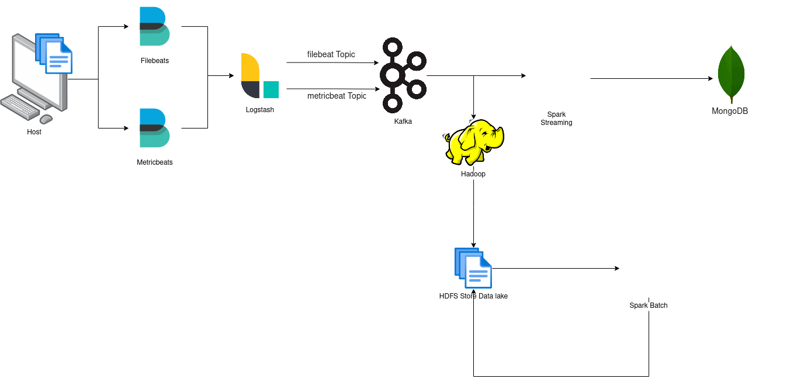

# big-data-project

A big data pipeline that distrubtes incoming logs from log collection tools ( Elastic Beats ) and saves them real time in mongodb and hdfs  using kafka as message broker

## Diagram

